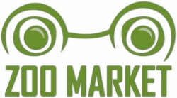
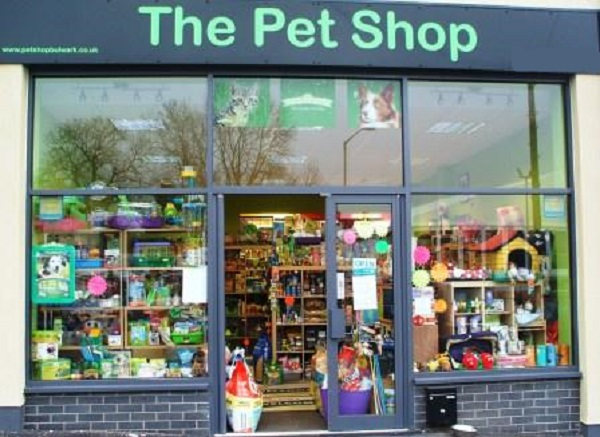
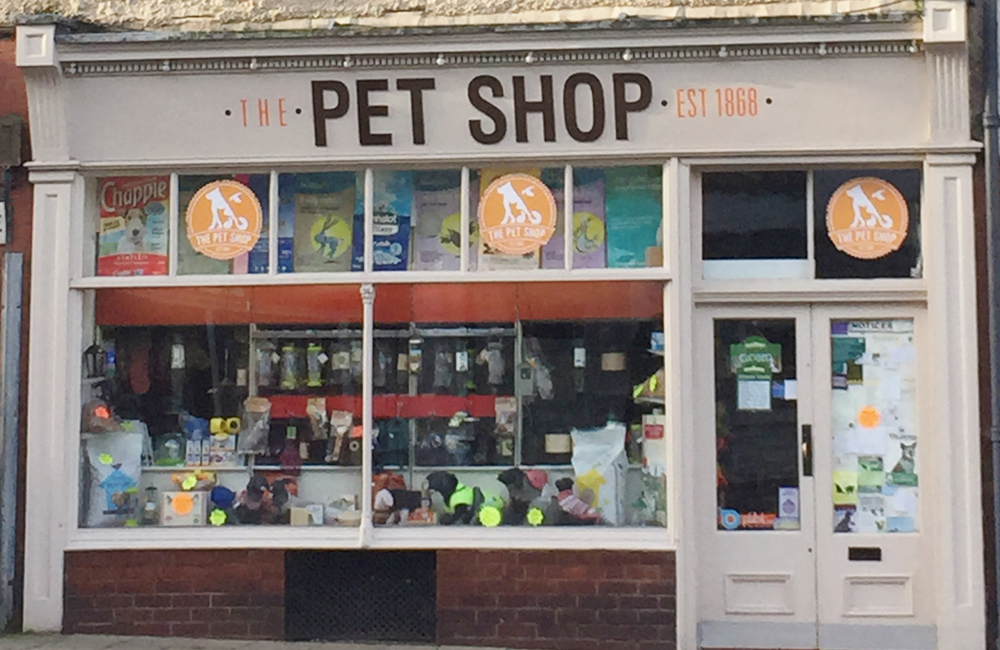
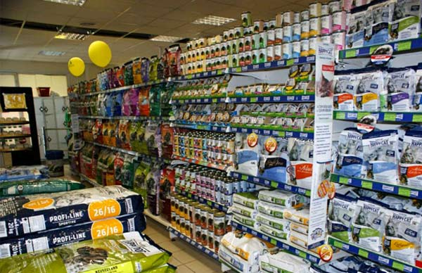
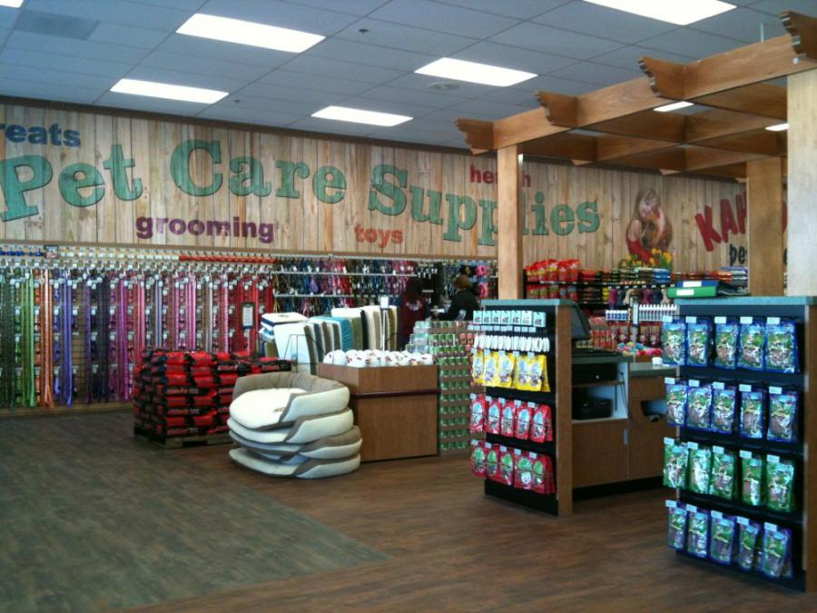
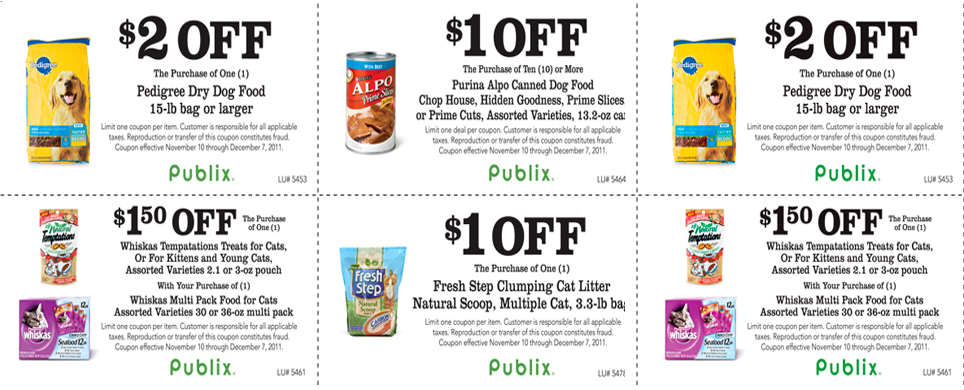

<!DOCTYPE html>
<html lang="en">
<head>
    <meta charset="UTF-8">
    <title>ЗООландия Нижневартовск| Магазин зоотоваров по доступным ценам </title>
    <link rel="stylesheet" href="styles/stylesheet.css">
    <link rel="stylesheet" href="styles/slick.css"/>
    <link rel="stylesheet" href="styles/slick-theme.css"/>
    <link rel="stylesheet" href="https://cdnjs.cloudflare.com/ajax/libs/font-awesome/4.7.0/css/font-awesome.min.css">
    <link rel="stylesheet"
          href="https://fonts.googleapis.com/css?family=Montserrat:400,700&amp;subset=cyrillic,cyrillic-ext">

</head>
<body>

    

        
        

            
8 (800) 255-35-35

            

                
<a href="#header">Главная</a>
                

                
<a href="#about_us">О нас</a>
                

                
<a href="#shares">Акции</a>
                

                
<a href="#shops">Магазины</a>
                

                
<a href="#contacts">Контакты</a>
                

            

        

    

    

        

        

        

    

О нас

Здесь вы можете указать информацию о вашей организации

    

        

            Сайт рыбатекст поможет дизайнеру, верстальщику,
            вебмастеру сгенерировать несколько абзацев более
            менее осмысленного текста рыбы на русском языке,
            а начинающему оратору отточить навык публичных
            выступлений в домашних условиях. При создании
            генератора мы использовали небезизвестный
            универсальный код речей.
             
            Текст генерируется абзацами
            случайным образом от двух до десяти предложений
            в абзаце, что позволяет сделать текст
            более привлекательным и живым для
            визуально-слухового восприятия.
        

        

    

    

        

            

                <h1>Лучшее для ваших питомцев</h1>
                
Текст генерируется абзацами случайным образом от двух до десяти предложений в абзаце, что позволяет
                    сделать текст более привлекательным и живым для визуально-слухового восприятия.

            

                <h1>Лучшее для ваших питомцев</h1>
                
Текст генерируется абзацами случайным образом от двух до десяти предложений в абзаце, что позволяет
                    сделать текст более привлекательным и живым для визуально-слухового восприятия.

            

                <h1>Лучшее для ваших питомцев</h1>
                
Текст генерируется абзацами случайным образом от двух до десяти предложений в абзаце, что позволяет
                    сделать текст более привлекательным и живым для визуально-слухового восприятия.

        

    

    
Акции

    
Здесь вы можете указать информацию о акциях

    

    
Наши Магазины

    
Здесь вы можете указать информацию о торговых точках

    

        <iframe src="https://yandex.ru/map-widget/v1/?um=constructor%3A07ddab68d1204ee73f301d5469c7824dc33397e18f49c15af0aafbd8dd01d437&amp;source=constructor"
                width="100%" height="430" frameborder="0"></iframe>
    

    
Контакты

    
Здесь вы можете указать ваши адреса и контакты

    

        
<h2 class="contacts_item">Магазин 1</h2>
            
Нижневартовск, улица Отличная, дом 1 8999-999-99-99

        
<h2 class="contacts_item">Магазин 2</h2>
            
Нижневартовск, улица Отличная, дом 1 8999-999-99-99

    

    <h1>8 (800) 255-35-35</h1>
    

        
<a href="#header">Главная</a>
        

        
<a href="#about_us">О нас</a>
        

        
<a href="#shares">Акции</a>
        

        
<a href="#shops">Магазины</a>
        

        
<a href="#contacts">Контакты</a>
        

    

</body>
</html>
